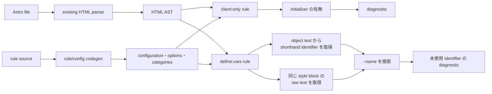

# Astro lint rules の全体像

この変更は Astro 向けの HTML nursery rule を 2 個追加します。どちらも既定で無効です。

## 2 個の rule

### `useAstroClientOnlyDirectiveValue`

initializer がない `client:only` を報告します。

```astro
<!-- diagnostic -->
<Component client:only />

<!-- valid -->
<Component client:only="react" />
```

判定は Astro directive の AST だけで完結します。

initializer の内容は検証しません。`client:only=""` と動的な式も許可します。

```rust
(name.text() == "only" && value.initializer().is_none()).then_some(())
```

### `noAstroUnusedDefineVarsInStyle`

`define:vars` の shorthand identifier と、同じ `<style>` にある `--name` を照合します。

```astro
<!-- diagnostic: foreground is unused -->
<style define:vars={{ foreground }}>
    p { color: black; }
</style>

<!-- valid -->
<style define:vars={{ foreground }}>
    p { color: var(--foreground); }
</style>
```

別の `<style>` に同名の文字列があっても、その定義には利用しません。

## Mermaid



workspace、module graph、JavaScript parser、CSS parser をこの rule 用には拡張しません。2 個の rule は HTML analyzer 内で完結します。

## 今回変更しない基盤

| area | path | 理由 |
| --- | --- | --- |
| module graph | `crates/biome_module_graph/` | project 情報を query しないため |
| workspace | `crates/biome_service/` | workspace metadata を使わないため |
| JavaScript parser | `crates/biome_js_parser/` | shorthand の raw text だけを調べるため |
| CSS parser | `crates/biome_css_parser/` | 同じ style block の raw text だけを調べるため |
| ruledoc | `crates/biome_ruledoc_utils/` | rule doc 用の workspace 初期化が不要なため |

## 対応範囲

`noAstroUnusedDefineVarsInStyle` は、ASCII の shorthand identifier だけで構成された object を扱います。

```astro
<style define:vars={{ foreground, background }}>
```

alias、computed key、spread、文字列 key、数値 key、ASCII 外の名前を object が含む場合、その directive は解析対象外です。style text 内の `--name` を raw text で検索し、名前の直後に identifier 境界がある場合だけ参照として数えます。comment 内の同名文字列も参照として数えます。

style text に backslash がある場合も解析対象外です。CSS escape の decode は実施しません。

`<style lang="scss">` と `<style lang="sass">` も対象外です。fallback parser は追加しません。

## 変更箇所

| 役割 | path |
| --- | --- |
| rule | `crates/biome_html_analyze/src/lint/nursery/` |
| options | `crates/biome_rule_options/src/` |
| generated registration | `crates/biome_configuration/src/`, `crates/biome_diagnostics_categories/src/categories.rs` |
| fixtures と snapshots | `crates/biome_html_analyze/tests/specs/nursery/` |

この branch は local commit のみを対象にします。changeset、push、upstream、pull request は含みません。
