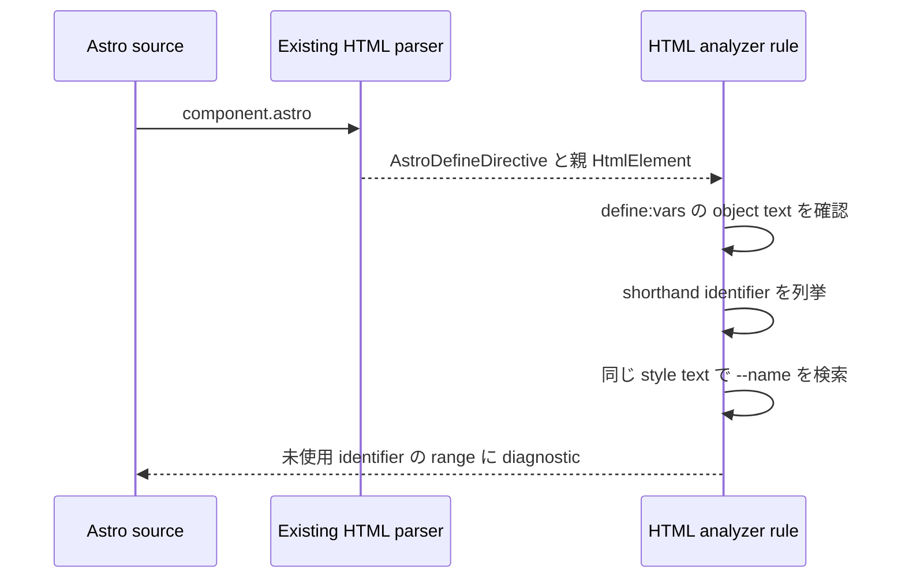

# Astro lint rules の実装メモ

## `define:vars` rule の流れ



query は project service を要求しない AST query です。

```rust
type Query = Ast<AstroDefineDirective>;
```

rule は directive の ancestor から `HtmlElement` を取得し、既存の `is_supported_style_tag()` で SCSS/Sass を除外します。

```rust
let Some(element) = directive.syntax().ancestors().find_map(HtmlElement::cast) else {
    return Vec::new();
};
if !element.is_supported_style_tag() {
    return Vec::new();
}
```

## 単純化した点

| 候補 | 採用内容 |
| --- | --- |
| workspace metadata | 追加しない |
| module graph facts | 追加しない |
| SCSS/Sass parser fallback | 追加しない |
| JavaScript/CSS の再 parse | 実施しない |
| 数値と escape の正規化 | 対象外 |
| alias、computed key、spread | object 全体を対象外にする |
| CSS token 化 | 実施せず、`--name` と直後の identifier 境界を raw text で調べる |

この方式では、source range は HTML expression token の absolute range から算出します。別座標への変換はありません。

## 対応する object

次の形式に限定します。

```astro
<style define:vars={{ foreground, background }}>
```

各 member は ASCII identifier の shorthand である必要があります。trailing comma は許可します。1 member でも別形式なら、その directive から diagnostic を生成しません。

CSS の照合は同じ style block の raw text に対する検索です。`--name-other` を `name` の参照としないよう、名前の直後に identifier 境界があることも確認します。comment 内の `--name` は参照として扱い、false positive を避ける判定になります。

style text に backslash がある場合、その directive は解析対象外です。CSS escape は decode しません。

## 主な変更箇所

| path | 内容 |
| --- | --- |
| `crates/biome_html_analyze/src/lint/nursery/use_astro_client_only_directive_value.rs` | `client:only` rule |
| `crates/biome_html_analyze/src/lint/nursery/no_astro_unused_define_vars_in_style.rs` | local AST の `define:vars` rule |
| `crates/biome_rule_options/src/` | 空の rule options |
| `crates/biome_configuration/src/` | generated rule registration |
| `crates/biome_html_analyze/tests/specs/nursery/` | rule fixtures と snapshots |

## 検証 command

```shell
just gen-rules
just gen-configuration
cargo test -p biome_html_analyze -- use_astro_client_only_directive_value
cargo test -p biome_html_analyze -- no_astro_unused_define_vars_in_style
just f
just l
git diff --check
```
